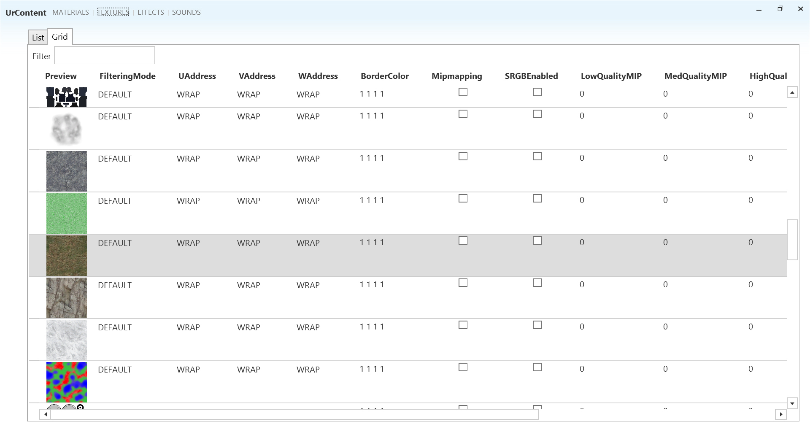

# UrContent

XML Content manager for Urho3D files

UrContent is a browser for Urho3D's xml file formats. It's intended purpose is to hide the existence of XML annotation files and
make it easier to use the files for a non-programmer. When an XML annotation file becomes the "default" state (where it's
non-existance would be the same as its' existence) the file is automatically removed.

This applies to:

* Sound XML Files
* Texture XML files

## TODO

* Cube maps
* Some sort of "help" screen instead of "void" editors for invalid selections
* Grid views for more resource types
* Object animation and scenes

## Dependencies

FirstFloor.ModernUI and Xceed WPF Toolkit

## UrhoInterop

UrhoInterop is a the C# library that UrContent uses to deal with Urho3Ds XML files, it's written with WPF in mind. You're welcome to use it for your own tools.

